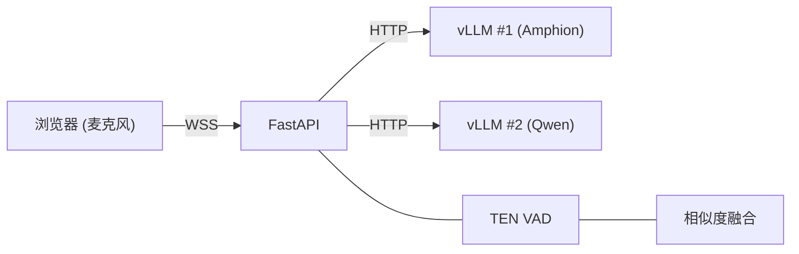

# AudioLLM Server

[](LICENSE)

基于 [Amphion](https://github.com/open-mmlab/Amphion) (vLLM) 的实时语音转写 Demo，集成 TEN VAD 语音端点检测。
支持双 ASR 模型（Amphion + Qwen）并行推理，带归一化质量评估与风险感知融合策略。

---

## 环境要求

- Python 3.10+
- 已启动的 vLLM 推理服务（兼容 OpenAI API）
- OpenSSL（用于生成自签名证书）

## 快速开始

```bash
# 安装依赖（二选一）
pip install -e .
uv sync

# 复制并编辑环境配置
cp .env.example .env

# 设置 vLLM 地址（也可直接编辑 .env）
export VLLM_BASE_URL="http://localhost:8000"
export VLLM_MODEL_NAME="Amphion/Amphion-3B"

# 启动服务
bash start.sh
```

浏览器打开 `https://<服务器IP>:8443` 即可使用。

> 首次访问时浏览器会提示自签名证书不安全，点击 **高级** → **继续访问** 即可。

---

## 系统架构



| 模块 | 说明 |
|---|---|
| **前端** | Web Audio API AudioWorklet 采集 16 kHz PCM，通过 WebSocket 发送 |
| **后端** | FastAPI，每个连接启动两个并发异步任务：VAD 任务（语音检测）+ LLM 任务（ASR 推理），互不阻塞 |
| **热词** | 在浏览器 UI 中管理，通过 WebSocket 实时同步到后端 |

---

## WebSocket 接口

服务暴露两个 WebSocket 端点：

| 端点 | 用途 |
|---|---|
| `/ws/audio` | 前端 Demo —— 浏览器麦克风采集 + UI 交互 |
| `/transcribe-streaming` | 服务对接 —— 标准 ASR 流式协议，供上游服务调用 |

### `/transcribe-streaming` 协议

通过 WebSocket 连接，可选 `language` 查询参数：

```
wss://<host>:<port>/transcribe-streaming?language=zh
```

**消息流程：**

```
客户端                                 服务端
  |                                      |
  |  ---- WebSocket 连接 -------------> |
  |  <--------  ready  ---------------  |
  |  ----  update_hotwords (可选) ----> |
  |  ----  start  --------------------> |
  |  ----  PCM 音频数据  -------------> |
  |  <--------  partial_asr  ---------  |
  |  ----  PCM 音频数据  -------------> |
  |  <--------  final_asr  -----------  |
  |  ----  stop  ---------------------> |
  |  <--------  final_asr  -----------  |
```

**客户端 → 服务端：**

| 消息 | 说明 |
|---|---|
| `{"type": "start", "mode": "asr_only", "format": "pcm_s16le", "sample_rate_hz": 16000, "channels": 1}` | 声明音频格式（发送 PCM 前必须先发） |
| `{"type": "update_hotwords", "hotwords": ["词1", "词2"]}` | 更新热词列表（可选，随时可发） |
| 二进制 PCM 帧 | 原始音频：16 kHz、单声道、s16le，建议每帧 80 ms（2560 字节） |
| `{"type": "stop"}` | 结束音频流，刷新剩余音频 |

**服务端 → 客户端：**

| 消息 | 说明 |
|---|---|
| `{"type": "ready"}` | 服务端就绪，可以开始发送音频 |
| `{"type": "partial_asr", "text": "...", "language": "zh"}` | 中间结果（语音进行中） |
| `{"type": "final_asr", "text": "...", "language": "zh"}` | 最终结果（语音片段结束后） |
| `{"type": "error", "message": "..."}` | 错误通知 |

**Python 调用示例：**

```python
import asyncio, json, ssl, websockets

async def transcribe(pcm_bytes: bytes):
    ctx = ssl.SSLContext(ssl.PROTOCOL_TLS_CLIENT)
    ctx.check_hostname = False
    ctx.verify_mode = ssl.CERT_NONE

    async with websockets.connect(
        "wss://localhost:8443/transcribe-streaming?language=zh", ssl=ctx
    ) as ws:
        ready = json.loads(await ws.recv())
        assert ready["type"] == "ready"

        await ws.send(json.dumps({
            "type": "start", "mode": "asr_only",
            "format": "pcm_s16le", "sample_rate_hz": 16000, "channels": 1,
        }))

        for i in range(0, len(pcm_bytes), 2560):
            await ws.send(pcm_bytes[i:i+2560])
            await asyncio.sleep(0.08)

        await ws.send(json.dumps({"type": "stop"}))

        async for msg in ws:
            data = json.loads(msg)
            print(f"[{data['type']}] {data.get('text', '')}")
```

**测试客户端：**

```bash
python tests/test_ws_client.py audio.wav
python tests/test_ws_client.py audio.wav --hotwords "武新华,挚音科技"
python tests/test_ws_client.py audio.wav --language en --chunk-ms 100
```

完整协议规范见 [docs/transcribe-streaming-protocol.md](docs/transcribe-streaming-protocol.md)。

---

## 启动双 vLLM 推理服务

启动 Amphion（默认端口 8000）：

```bash
MODEL_PATH=/path/to/Amphion-3B bash scripts/start_vllm_amphion.sh
```

在另一个终端启动 Qwen（端口 8001）：

```bash
MODEL_PATH=/path/to/Qwen3-ASR-1.7B bash scripts/start_vllm_qwen.sh
```

---

## 配置说明

所有配置通过环境变量管理，详见 [.env.example](.env.example)。

### 模型与推理

| 变量 | 默认值 | 说明 |
|---|---|---|
| `VLLM_BASE_URL` | `http://localhost:8000` | 主模型 vLLM 地址 |
| `VLLM_MODEL_NAME` | `Amphion/Amphion-3B` | 主模型名称 |
| `SECONDARY_VLLM_BASE_URL` | `http://localhost:8001` | 副模型 vLLM 地址（Qwen） |
| `SECONDARY_VLLM_MODEL_NAME` | `Qwen/Qwen3-ASR-1.7B` | 副模型名称 |
| `ENABLE_PRIMARY_ASR` | `1` | 启用主 ASR 模型 |
| `ENABLE_SECONDARY_ASR` | `1` | 启用双模型并行 ASR |
| `PRIMARY_ASR_TIMEOUT` | `4.0` | 主模型单次请求超时（秒） |
| `ASR_REQUEST_TIMEOUT` | `120` | HTTP 请求超时（秒） |

### 输出与调试

| 变量 | 默认值 | 说明 |
|---|---|---|
| `DEBUG_SHOW_DUAL_ASR` | `1` | 在响应中包含双 ASR 调试信息 |
| `ENABLE_PSEUDO_STREAM` | `1` | 启用伪流式逐步输出 |
| `PSEUDO_STREAM_INTERVAL_MS` | `500` | 伪流式输出最小间隔（毫秒） |

### 融合策略

| 变量 | 默认值 | 说明 |
|---|---|---|
| `FUSION_SIMILARITY_THRESHOLD` | `0.85` | 相似度阈值 |
| `FUSION_MIN_PRIMARY_SCORE` | `0.55` | 主模型最低质量分 |
| `FUSION_MAX_REPETITION_RATIO` | `0.35` | 重复风险阈值 |
| `FUSION_DISAGREEMENT_THRESHOLD` | `0.55` | 分歧度上限（超过则回退） |
| `FUSION_HOTWORD_BOOST` | `0.12` | 每个热词对主模型评分的加成 |
| `FUSION_PRIMARY_SCORE_MARGIN` | `0.08` | 主模型需超过副模型的最低分差 |

### VAD 参数

| 变量 | 默认值 | 说明 |
|---|---|---|
| `VAD_THRESHOLD` | `0.5` | 语音概率阈值 |
| `VAD_SMOOTHING_ALPHA` | `0.35` | 概率 EMA 平滑系数 |
| `VAD_START_FRAMES` | `3` | 触发语音起始所需连续帧数 |
| `VAD_PRE_SPEECH_MS` | `500` | 语音起始前的预留音频（毫秒） |
| `VAD_END_FRAMES` | `SILENCE_DURATION_MS/10` | 触发语音结束所需连续静默帧数 |
| `VAD_KEEP_TAIL_MS` | `40` | 语音结束后保留的尾部音频（毫秒） |
| `SILENCE_DURATION_MS` | `200` | 判定语音结束的静默时长（毫秒） |
| `MIN_SEGMENT_DURATION_MS` | `350` | VAD 最短语音片段时长（毫秒） |

### 服务

| 变量 | 默认值 | 说明 |
|---|---|---|
| `PORT` | `8443` | HTTPS 服务端口 |

---

## 项目结构

```
backend/
  main.py                    # FastAPI 入口
  config.py                  # 环境变量配置
  http_client.py             # 共享异步 HTTP 客户端
  session.py                 # WebSocket 会话（VAD + ASR 管线）
  asr_streaming_session.py   # 流式 ASR 会话
  audio/                     # 音频信号处理
    utils.py                 #   48→16 kHz 重采样、PCM/WAV 转换
    vad.py                   #   语音端点检测（TEN VAD + 备用方案）
  asr/                       # ASR 模型交互
    client.py                #   vLLM API 调用与输出解析
    fusion.py                #   双模型融合逻辑
    hotword.py               #   热词提取服务
    prompt.py                #   LLM Prompt 模板
frontend/                    # 静态 Web 前端
scripts/                     # vLLM 服务启动脚本
tests/                       # 测试工具
docs/                        # 协议文档
```

## 参与贡献

请查看 [CONTRIBUTING.md](CONTRIBUTING.md) 了解开发环境搭建与贡献指南。

## 开源许可

本项目采用 [Apache License 2.0](LICENSE) 开源许可协议。
