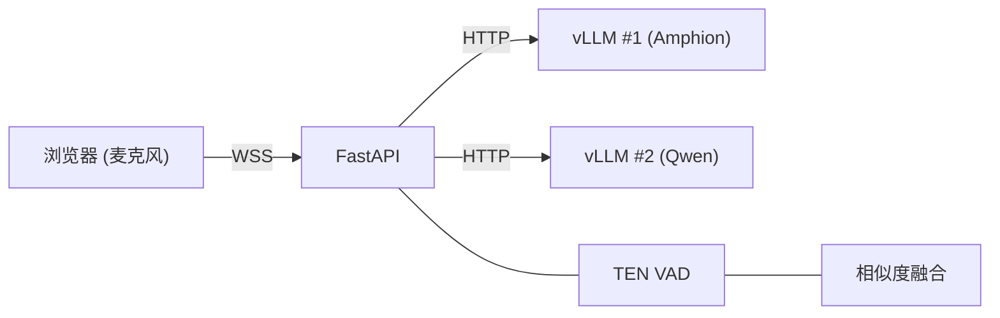

# AudioLLM Server

[](LICENSE)

基于 [Amphion](https://github.com/open-mmlab/Amphion) (vLLM) 的实时语音转写 Demo，集成 TEN VAD 语音端点检测。
支持双 ASR 模型（Amphion + Qwen）并行推理，带归一化质量评估与风险感知融合策略。

---

## 环境要求

- Python 3.10+
- 已启动的 vLLM 推理服务（兼容 OpenAI API）
- OpenSSL（用于生成自签名证书）

## 快速开始

```bash
# 安装依赖（二选一）
pip install -e .
uv sync

# 编辑服务端配置（vLLM 地址、模型名等）
vim backend/config.json

# 启动服务
bash start.sh
```

浏览器打开 `https://<服务器IP>:8443` 即可使用。

> 首次访问时浏览器会提示自签名证书不安全，点击 **高级** → **继续访问** 即可。

---

## 系统架构



| 模块 | 说明 |
|---|---|
| **前端** | Web Audio API AudioWorklet 采集 16 kHz PCM，通过 WebSocket 发送 |
| **后端** | FastAPI，每个连接启动两个并发异步任务：VAD 任务（语音检测）+ LLM 任务（ASR 推理），互不阻塞 |
| **热词** | 在浏览器 UI 中管理，通过 WebSocket 实时同步到后端 |

---

## WebSocket 接口

服务暴露两个 WebSocket 端点：

| 端点 | 用途 |
|---|---|
| `/ws/audio` | 前端 Demo —— 浏览器麦克风采集 + UI 交互 |
| `/transcribe-streaming` | 服务对接 —— 标准 ASR 流式协议，供上游服务调用 |

### `/transcribe-streaming` 协议

通过 WebSocket 连接：

```
wss://<host>:<port>/transcribe-streaming
```

**消息流程：**

```
客户端                                 服务端
  |                                      |
  |  ---- WebSocket 连接 -------------> |
  |  <--------  ready  ---------------  |
  |  ----  start (语种/热词/配置) ----> |
  |  ----  PCM 音频数据  -------------> |
  |  <--------  partial  -------------  |
  |  ----  PCM 音频数据  -------------> |
  |  <--------  final  ---------------  |
  |  ----  stop  ---------------------> |
  |  <--------  final (保证返回) ------  |
```

**客户端 → 服务端：**

| 消息 | 说明 |
|---|---|
| `{"type": "start", ...}` | 声明音频格式、语种、热词和可选配置覆写（见下方示例，发送 PCM 前必须先发） |
| `{"type": "update_hotwords", "hotwords": ["词1", "词2"]}` | 会话中途更新热词列表（可选，随时可发） |
| 二进制 PCM 帧 | 原始音频：16 kHz、单声道、s16le，建议每帧 80 ms（2560 字节） |
| `{"type": "stop"}` | 结束音频流。服务端会处理所有剩余音频并保证返回一条 `final` |

**服务端 → 客户端：**

| 消息 | 说明 |
|---|---|
| `{"type": "ready"}` | 服务端就绪，可以开始发送音频 |
| `{"type": "partial", "text": "...", "language": "zh"}` | 中间结果（语音进行中的实时识别） |
| `{"type": "final", "text": "...", "language": "zh"}` | 最终结果（一段语音结束后，或收到 stop 后） |
| `{"type": "error", "message": "..."}` | 错误通知 |

**`start` 消息完整格式：**

```json
{
  "type": "start",
  "format": "pcm_s16le",
  "sample_rate_hz": 16000,
  "channels": 1,
  "language": "zh",
  "hotwords": ["热词1", "热词2"],
  "config": {
    "enable_primary_asr": true,
    "vad_threshold": 0.3
  }
}
```

- `language` — 源语种代码（`zh`/`en`/`id`/`th`），可选
- `hotwords` — 热词列表，可选。支持万级数量（10K 词约 300KB，无传输压力）
- `config` — 服务端参数覆写，可选。只传需要修改的项，详见 [客户端可配置参数](#客户端可配置参数)

**Python 调用示例：**

```python
import asyncio, json, ssl, websockets

async def transcribe(pcm_bytes: bytes):
    ctx = ssl.SSLContext(ssl.PROTOCOL_TLS_CLIENT)
    ctx.check_hostname = False
    ctx.verify_mode = ssl.CERT_NONE

    async with websockets.connect(
        "wss://localhost:8443/transcribe-streaming", ssl=ctx
    ) as ws:
        ready = json.loads(await ws.recv())
        assert ready["type"] == "ready"

        await ws.send(json.dumps({
            "type": "start",
            "format": "pcm_s16le",
            "sample_rate_hz": 16000,
            "channels": 1,
            "language": "zh",
            "hotwords": ["挚音科技", "武新华"],
            "config": {"vad_threshold": 0.4},
        }))

        for i in range(0, len(pcm_bytes), 2560):
            await ws.send(pcm_bytes[i:i+2560])
            await asyncio.sleep(0.08)

        await ws.send(json.dumps({"type": "stop"}))

        async for msg in ws:
            data = json.loads(msg)
            print(f"[{data['type']}] {data.get('text', '')}")
            if data["type"] == "final":
                break
```

**测试客户端：**

```bash
python tests/test_ws_client.py audio.wav
python tests/test_ws_client.py audio.wav --hotwords "武新华,挚音科技"
python tests/test_ws_client.py audio.wav --language en --chunk-ms 100
```

完整协议规范见 [docs/transcribe-streaming-protocol.md](docs/transcribe-streaming-protocol.md)。

---

## 启动双 vLLM 推理服务

启动 Amphion（默认端口 8000）：

```bash
MODEL_PATH=/path/to/Amphion-3B bash scripts/start_vllm_amphion.sh
```

在另一个终端启动 Qwen（端口 8001）：

```bash
MODEL_PATH=/path/to/Qwen3-ASR-1.7B bash scripts/start_vllm_qwen.sh
```

---

## 配置说明

服务端默认配置保存在 [`backend/config.json`](backend/config.json)，修改后重启服务生效。

客户端可在 `start` 消息的 `config` 字段中覆写其中任意一项，只需传入要修改的参数，未传入的保持服务端默认值。

### 客户端可配置参数

#### 模型选择

| 参数 | 类型 | 默认值 | 说明 |
|---|---|---|---|
| `vllm_base_url` | string | `http://localhost:8000` | 主 ASR 模型的服务地址 |
| `vllm_model_name` | string | `Amphion/Amphion-3B` | 主 ASR 模型名称 |
| `secondary_vllm_base_url` | string | `http://localhost:8001` | 副 ASR 模型的服务地址 |
| `secondary_vllm_model_name` | string | `Qwen/Qwen3-ASR-1.7B` | 副 ASR 模型名称 |
| `enable_primary_asr` | bool | `true` | 是否启用主模型。关闭后只用副模型 |
| `enable_secondary_asr` | bool | `true` | 是否启用副模型。关闭后只用主模型 |

#### 推理控制

| 参数 | 类型 | 默认值 | 说明 |
|---|---|---|---|
| `primary_asr_timeout` | float | `4.0` | 主模型单次推理的超时秒数，超时则放弃主模型结果 |
| `asr_request_timeout` | float | `120` | 发给模型的 HTTP 请求总超时秒数 |

#### 实时输出

| 参数 | 类型 | 默认值 | 说明 |
|---|---|---|---|
| `enable_pseudo_stream` | bool | `true` | 是否开启"伪流式"——说话过程中提前输出中间结果 |
| `pseudo_stream_interval_ms` | int | `500` | 伪流式输出的最小间隔（毫秒），值越小更新越频繁 |

#### 语音检测 (VAD)

控制服务端如何判断"用户开始说话"和"用户说完了"。

| 参数 | 类型 | 默认值 | 说明 |
|---|---|---|---|
| `vad_threshold` | float | `0.5` | 语音判定灵敏度（0-1）。值越低越容易触发，但也更容易误判噪音为语音 |
| `silence_duration_ms` | int | `200` | 说话停顿多久算"说完了"（毫秒）。值越大越不容易被短暂停顿打断 |
| `vad_smoothing_alpha` | float | `0.35` | 语音概率的平滑系数（0-1）。值越大波动越小，但响应越慢 |
| `vad_start_frames` | int | `3` | 连续多少帧检测到语音才算"开始说话"。防止瞬间噪音误触发 |
| `vad_pre_speech_ms` | int | `500` | 检测到说话后，往前多保留多少毫秒的音频。避免开头被截掉 |
| `vad_end_frames` | int | `20` | 连续多少帧静默才算"说完了"。和 `silence_duration_ms` 配合使用 |
| `vad_keep_tail_ms` | int | `40` | 语音结束后多保留多少毫秒的尾巴音频 |
| `min_segment_duration_ms` | int | `350` | 低于此时长的语音片段会被丢弃（过滤噪音短脉冲） |

#### 双模型融合

当主副模型同时启用时，系统用以下参数决定采信哪个模型的结果。

| 参数 | 类型 | 默认值 | 说明 |
|---|---|---|---|
| `fusion_similarity_threshold` | float | `0.85` | 两个模型结果的文本相似度达到此值时，认为它们"一致"，优先选主模型 |
| `fusion_min_primary_score` | float | `0.55` | 主模型结果的最低质量分。低于此值则不信任主模型 |
| `fusion_max_repetition_ratio` | float | `0.35` | 主模型输出中重复内容的占比上限。超过则判定为"幻觉" |
| `fusion_disagreement_threshold` | float | `0.55` | 两模型结果的分歧度上限。超过则回退到副模型 |
| `fusion_hotword_boost` | float | `0.12` | 主模型命中每个热词时获得的评分加成 |
| `fusion_primary_score_margin` | float | `0.08` | 主模型评分需超过副模型至少这么多才会被选用 |

#### 调试

| 参数 | 类型 | 默认值 | 说明 |
|---|---|---|---|
| `debug_show_dual_asr` | bool | `true` | 在 `/ws/audio` 响应中包含双 ASR 调试信息 |

### 服务

| 变量 | 默认值 | 说明 |
|---|---|---|
| `PORT` | `8443` | HTTPS 服务端口（启动脚本参数） |

---

## 项目结构

```
backend/
  main.py                    # FastAPI 入口
  config.py                  # 配置加载（从 config.json）
  config.json                # 服务端默认配置
  http_client.py             # 共享异步 HTTP 客户端
  session.py                 # WebSocket 会话（VAD + ASR 管线）
  asr_streaming_session.py   # 流式 ASR 会话
  audio/                     # 音频信号处理
    utils.py                 #   48→16 kHz 重采样、PCM/WAV 转换
    vad.py                   #   语音端点检测（TEN VAD + 备用方案）
  asr/                       # ASR 模型交互
    client.py                #   vLLM API 调用与输出解析
    fusion.py                #   双模型融合逻辑
    hotword.py               #   热词提取服务
    prompt.py                #   LLM Prompt 模板
frontend/                    # 静态 Web 前端
scripts/                     # vLLM 服务启动脚本
tests/                       # 测试工具
docs/                        # 协议文档
```

## 参与贡献

请查看 [CONTRIBUTING.md](CONTRIBUTING.md) 了解开发环境搭建与贡献指南。

## 开源许可

本项目采用 [Apache License 2.0](LICENSE) 开源许可协议。
