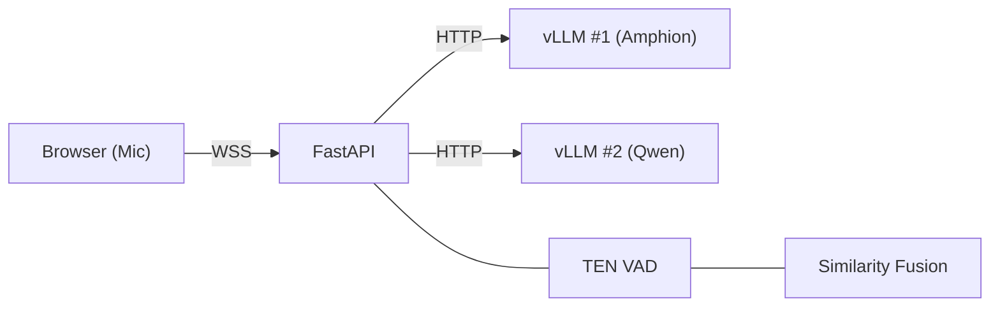

# AudioLLM Server

[](LICENSE)

Real-time audio transcription demo powered by [Amphion](https://github.com/open-mmlab/Amphion) (vLLM) with TEN VAD speech segmentation.
Supports dual-ASR parallel inference (Amphion + Qwen) with normalized, risk-aware fusion.

## Prerequisites

- Python 3.10+
- A running vLLM server with Amphion (OpenAI-compatible API)
- OpenSSL (for self-signed certificate generation)

## Quick Start

```bash
# Install dependencies
pip install -e .

# Or using uv
uv sync

# Copy and edit the environment file
cp .env.example .env

# Set vLLM endpoint (or edit .env)
export VLLM_BASE_URL="http://localhost:8000"
export VLLM_MODEL_NAME="Amphion/Amphion-3B"

# Start the server
bash start.sh
```

Open `https://<your-server-ip>:8443` in your browser.

> On first visit, the browser will warn about the self-signed certificate.
> Click **Advanced** -> **Proceed** to continue.

## Architecture



- **Frontend**: Web Audio API AudioWorklet captures 16 kHz PCM, sends via WebSocket
- **Backend**: FastAPI with two concurrent async tasks per connection:
  - VAD Task: processes audio frames, detects speech segments (non-blocking)
  - LLM Task: consumes segments from asyncio.Queue, calls vLLM API (independent)
- **Hotwords**: Managed in the browser UI, synced to backend via WebSocket in real-time

## WebSocket API

The server exposes two WebSocket endpoints:

| Endpoint | Purpose |
|---|---|
| `/ws/audio` | Frontend demo — browser microphone capture with UI integration |
| `/transcribe-streaming` | Service integration — standard ASR streaming protocol for upstream services |

### `/transcribe-streaming` Protocol

Connect via WebSocket with optional `language` query parameter:

```
wss://<host>:<port>/transcribe-streaming?language=zh
```

**Message flow:**

```
Client                                Server
  |                                      |
  |  ---- WebSocket connect -----------> |
  |  <--------  ready  ---------------   |
  |  ----  update_hotwords (optional) -> |
  |  ----  start  ---------------------> |
  |  ----  binary PCM chunks  ---------> |
  |  <--------  partial_asr  ----------  |
  |  ----  binary PCM chunks  ---------> |
  |  <--------  final_asr  ------------  |
  |  ----  stop  ----------------------> |
  |  <--------  final_asr  ------------  |
```

**Client -> Server messages:**

| Message | Description |
|---|---|
| `{"type": "start", "mode": "asr_only", "format": "pcm_s16le", "sample_rate_hz": 16000, "channels": 1}` | Declare audio format (required before sending PCM) |
| `{"type": "update_hotwords", "hotwords": ["term1", "term2"]}` | Update hotword list (optional, can be sent anytime) |
| Binary PCM frames | Raw audio: 16 kHz, mono, s16le. Recommended chunk: 80 ms (2560 bytes) |
| `{"type": "stop"}` | End audio stream, flush remaining audio |

**Server -> Client messages:**

| Message | Description |
|---|---|
| `{"type": "ready"}` | Server ready to receive audio |
| `{"type": "partial_asr", "text": "...", "language": "zh"}` | Interim transcription (during speech) |
| `{"type": "final_asr", "text": "...", "language": "zh"}` | Final transcription (after speech segment ends) |
| `{"type": "error", "message": "..."}` | Error notification |

**Quick example (Python):**

```python
import asyncio, json, ssl, websockets

async def transcribe(pcm_bytes: bytes):
    ctx = ssl.SSLContext(ssl.PROTOCOL_TLS_CLIENT)
    ctx.check_hostname = False
    ctx.verify_mode = ssl.CERT_NONE

    async with websockets.connect(
        "wss://localhost:8443/transcribe-streaming?language=zh", ssl=ctx
    ) as ws:
        ready = json.loads(await ws.recv())
        assert ready["type"] == "ready"

        await ws.send(json.dumps({
            "type": "start", "mode": "asr_only",
            "format": "pcm_s16le", "sample_rate_hz": 16000, "channels": 1,
        }))

        for i in range(0, len(pcm_bytes), 2560):
            await ws.send(pcm_bytes[i:i+2560])
            await asyncio.sleep(0.08)

        await ws.send(json.dumps({"type": "stop"}))

        async for msg in ws:
            data = json.loads(msg)
            print(f"[{data['type']}] {data.get('text', '')}")
```

**Test client:**

```bash
python tests/test_ws_client.py audio.wav
python tests/test_ws_client.py audio.wav --hotwords "武新华,挚音科技"
python tests/test_ws_client.py audio.wav --language en --chunk-ms 100
```

For the complete protocol specification, see [docs/transcribe-streaming-protocol.md](docs/transcribe-streaming-protocol.md).

## Run Two vLLM Servers

Start Amphion:

```bash
MODEL_PATH=/path/to/Amphion-3B bash scripts/start_vllm_amphion.sh
```

Then start Qwen on port 8001 in another terminal:

```bash
MODEL_PATH=/path/to/Qwen3-ASR-1.7B bash scripts/start_vllm_qwen.sh
```

## Configuration

All configuration is via environment variables (see [.env.example](.env.example) for the full list):

| Variable | Default | Description |
|---|---|---|
| `VLLM_BASE_URL` | `http://localhost:8000` | Primary vLLM server address |
| `VLLM_MODEL_NAME` | `Amphion/Amphion-3B` | Primary model name |
| `SECONDARY_VLLM_BASE_URL` | `http://localhost:8001` | Secondary vLLM server address (Qwen) |
| `SECONDARY_VLLM_MODEL_NAME` | `Qwen/Qwen3-ASR-1.7B` | Secondary model name |
| `ENABLE_PRIMARY_ASR` | `1` | Enable primary ASR model |
| `ENABLE_SECONDARY_ASR` | `1` | Enable dual-model parallel ASR |
| `PRIMARY_ASR_TIMEOUT` | `4.0` | Primary ASR per-request timeout (seconds) |
| `ASR_REQUEST_TIMEOUT` | `120` | HTTP request timeout (seconds) |
| `DEBUG_SHOW_DUAL_ASR` | `1` | Include dual-ASR debug info in responses |
| `ENABLE_PSEUDO_STREAM` | `1` | Enable pseudo-streaming partial output |
| `PSEUDO_STREAM_INTERVAL_MS` | `500` | Minimum interval between partial outputs (ms) |
| `FUSION_SIMILARITY_THRESHOLD` | `0.85` | Similarity threshold for fusion logic |
| `FUSION_MIN_PRIMARY_SCORE` | `0.55` | Minimum primary quality score |
| `FUSION_MAX_REPETITION_RATIO` | `0.35` | Repetition risk threshold |
| `FUSION_DISAGREEMENT_THRESHOLD` | `0.55` | Max disagreement before fallback |
| `FUSION_HOTWORD_BOOST` | `0.12` | Per-hotword boost to primary score |
| `FUSION_PRIMARY_SCORE_MARGIN` | `0.08` | Required primary score margin over secondary |
| `VAD_THRESHOLD` | `0.5` | VAD speech probability threshold |
| `VAD_SMOOTHING_ALPHA` | `0.35` | EMA smoothing for VAD probability |
| `VAD_START_FRAMES` | `3` | Consecutive speech frames to start segment |
| `VAD_PRE_SPEECH_MS` | `500` | Pre-roll audio before speech start (ms) |
| `VAD_END_FRAMES` | `SILENCE_DURATION_MS/10` | Consecutive non-speech frames to end segment |
| `VAD_KEEP_TAIL_MS` | `40` | Trailing audio to keep after speech end (ms) |
| `SILENCE_DURATION_MS` | `200` | Silence duration to end speech segment (ms) |
| `MIN_SEGMENT_DURATION_MS` | `350` | Minimum VAD segment duration (ms) |
| `PORT` | `8443` | HTTPS server port |

## Project Structure

```
backend/
  main.py                    # FastAPI entry point
  config.py                  # Environment variable configuration
  http_client.py             # Shared async HTTP client
  session.py                 # WebSocket session (VAD + ASR pipeline)
  asr_streaming_session.py   # Streaming ASR session
  audio/                     # Audio signal processing
    utils.py                 # 48→16 kHz resampler, PCM/WAV conversion
    vad.py                   # Voice Activity Detection (TEN VAD + fallback)
  asr/                       # ASR model interaction
    client.py                # vLLM API calls and output parsing
    fusion.py                # Dual-model fusion logic
    hotword.py               # Hotword extraction service
    prompt.py                # LLM prompt templates
frontend/                    # Static web frontend
scripts/                     # vLLM server launch scripts
tests/                       # Test utilities
docs/                        # Protocol documentation
```

## Contributing

See [CONTRIBUTING.md](CONTRIBUTING.md) for development setup and guidelines.

## License

This project is licensed under the [Apache License 2.0](LICENSE).
